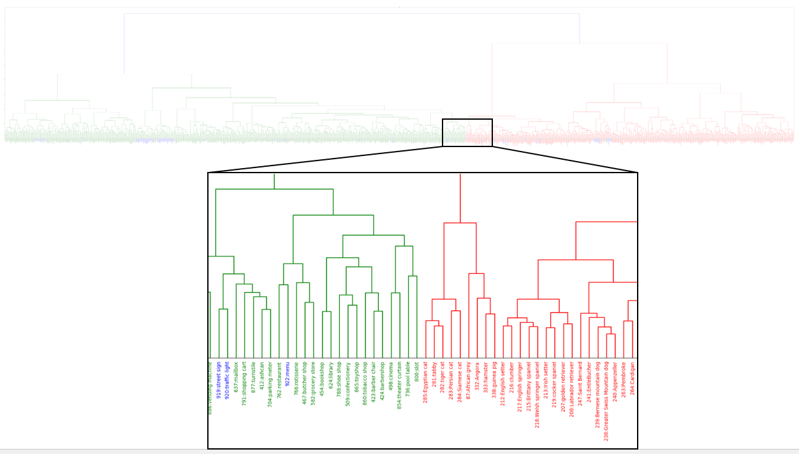

# imagenet_hierarchy_analysis
Using these files, you can input Imagenet-1k images to each image encoder, perform hierarchical clustering of the obtained features, and create a dendrogram based on the results.
A confusion matrix compared to the ground truth can also be obtained. 

# DEMO
 
 
# Requirement
 
* clip
* pytorch_pretrained_vit
* timm
 
# Installation
  
```bash
pip install clip pytorch_pretrained_vit timm
```
 
# Usage
 
First, run `extract_feature.py` and save the averaged feature for each class.
Then, run `hierarchichal_clustering.py` to obtain a dendrogram.
 
 
# Author
  
* Reo Terauchi
* Kawakami Lab @ Tokyo Tech.
* terauchi.r.aa[at]m.titech.ac.jp
